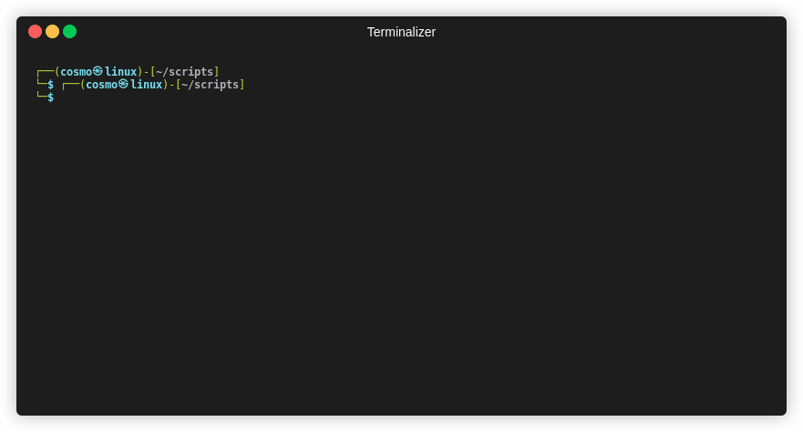

# Linux System Setup Automation Script for Essential Ethical Hacking and System Hardening



Automate the setup of your Debian-based Linux system with this handy shell script! This script is designed to streamline the process of updating your system, installing wordlist repositories, and enabling the Uncomplicated Firewall (UFW).

## Table of Contents

- [Features](#features)
- [Usage](#usage)
- [Contributing](#contributing)
- [License](#license)

## Features

- Detects and supports Debian, Ubuntu, and Linux Mint.
- Silently updates and upgrades the system.
- Installs popular wordlist repositories.
- Sets up and enables UFW (Uncomplicated Firewall).

## Usage

1. Clone this repository to your local machine.
```
git clone https://github.com/ChrisGarey/automated_security_setup.git
```
2. Navigate to the cloned directory.
```
cd automated_security_setup
```

3. Make the script executable.
```
chmod +x automate_setup.sh
```

4. Run the script with superuser privileges(sudo).
```
sudo ./automate_setup.sh
```

## Contributing

Contributions are welcome! Feel free to submit issues and pull requests.

## License

This project is licensed under the MIT License - see the LICENSE file for details.

Enjoy automating your Linux system setup!

Chris Garey